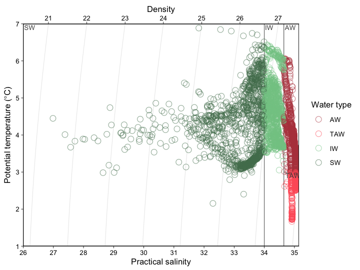
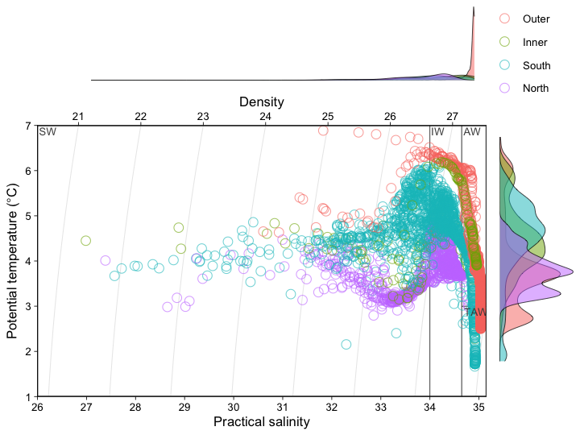
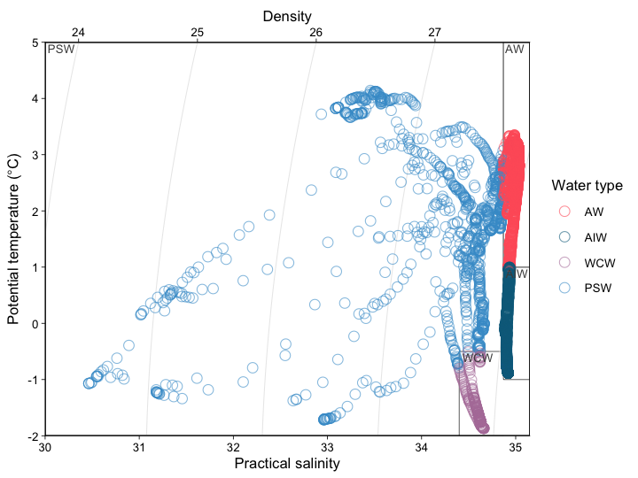
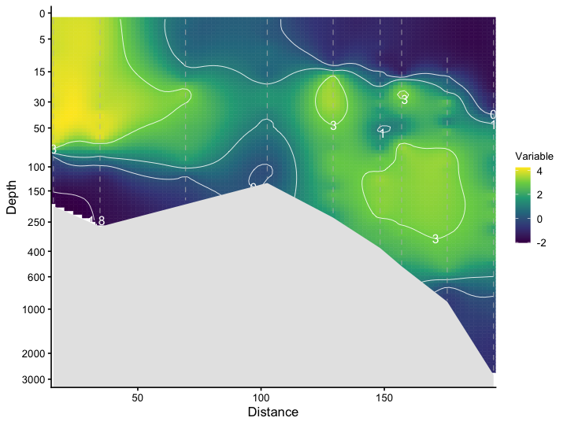
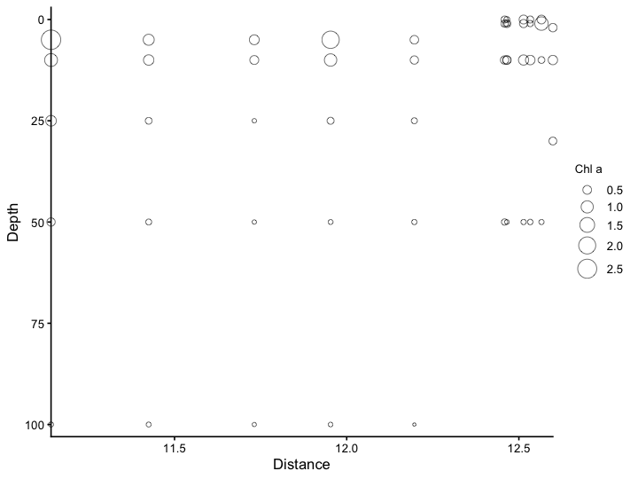

# ggOceanPlots
**Water mass classification, temperature-salinity (TS) and section plots using ggplot2 to aid the analysis of oceanographic data. R package version 0.2.0**

ggOceanPlots turns a tidy data frame of CTD or bottle data into publication-ready figures:

- **`define_water_type()`** — classify each temperature-salinity observation into a water mass.
- **`ts_plot()`** — temperature-salinity diagrams with isopycnals, water-mass polygons and optional marginal density plots.
- **`section_plot()`** — interpolated oceanographic sections or bubble plots along a transect.

These functions originate from [PlotSvalbard](https://github.com/MikkoVihtakari/PlotSvalbard) and are kept up to date here. The package is tuned for the Svalbard region but accepts custom water-mass definitions. For maps of the same data, see the companion package [ggOceanMaps](https://github.com/MikkoVihtakari/ggOceanMaps).

> **Using an AI assistant?** See [AGENTS.md](AGENTS.md) for a task-oriented guide with the common pitfalls spelled out.

## Installation

The package can be installed from GitHub using [**devtools**](https://cran.r-project.org/package=devtools) (or [remotes](https://cran.r-project.org/package=remotes)):


``` r
devtools::install_github("MikkoVihtakari/ggOceanPlots")
```

## Temperature-salinity plots

`ts_plot()` returns a ggplot2 object. By default points are coloured by water type, isopycnals are drawn, and the relevant water-mass polygons are labelled.


``` r
library(ggOceanPlots)

ts_plot(ctd_kongsfjord)
```

<div class="figure">

<p class="caption">plot of chunk ts-basic</p>
</div>

The `color` argument is overloaded: `"watertype"` (default) colours by classified water mass, a **column name** scales colour to that variable, and a literal colour name (e.g. `"red"`) paints every point one colour. Marginal density plots can be added with `margin_distr = TRUE`.


``` r
ts_plot(ctd_kongsfjord, color = "area", margin_distr = TRUE)
```

<div class="figure">

<p class="caption">plot of chunk ts-area</p>
</div>

Custom or alternative water masses are passed through the `WM` argument (`rijpfjord_watermasses` and `isfjord_watermasses` ship with the package). Set `WM = NULL` to drop the polygons entirely.


``` r
ts_plot(ctd_rijpfjord, WM = rijpfjord_watermasses)
```

<div class="figure">

<p class="caption">plot of chunk ts-rijp</p>
</div>

## Water-mass classification

`define_water_type()` returns the classification on its own, or bound to the data:


``` r
head(define_water_type(ctd_kongsfjord, bind = TRUE))
#>   station    depth  temp    sal pressure  area  density watertype
#> 2    KpN6 1.978902 4.319 32.924        2 South 1026.112        SW
#> 3    KpN6 2.968346 4.366 32.778        3 South 1025.996        SW
#> 4    KpN6 4.947219 4.395 32.861        5 South 1026.068        SW
#> 5    KpN6 5.936649 4.457 32.983        6 South 1026.163        SW
#> 6    KpN6 6.926074 4.535 33.074        7 South 1026.232        SW
#> 7    KpN6 7.915493 4.775 33.328        8 South 1026.412        SW
```

## Section plots

`section_plot()` produces an interpolated section (`interpolate = TRUE`) or a bubble plot (the default). A logarithmic y-axis helps when station depths differ greatly, and contour lines can be labelled.


``` r
section_plot(ctd_rijpfjord, x = "dist", y = "pressure", z = "temp",
             bottom = "bdepth", interpolate = TRUE, log_y = TRUE,
             contour = c(-1.8, 0, 1, 3))
```

<div class="figure">

<p class="caption">plot of chunk section</p>
</div>

Bubble plots suit sparse samples such as water-bottle data:


``` r
section_plot(chlorophyll[grepl("KpN.|Kb[0-4]", chlorophyll$Station), ],
             x = "lon", y = "From", z = "Chla", zlab = "Chl a")
```

<div class="figure">

<p class="caption">plot of chunk bubble</p>
</div>

## Citation


``` r
citation("ggOceanPlots")
```

Bug reports and feature requests are welcome at <https://github.com/MikkoVihtakari/ggOceanPlots/issues>.
